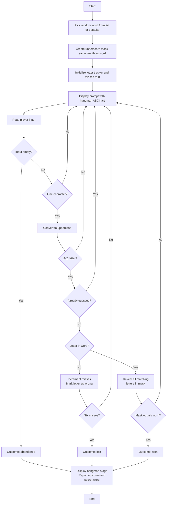

# Execution Flow

All ports follow the same V4-style sequence with visual hangman display and improved error handling.



## Detailed Execution Steps

### 1. Game Initialization
- **Pick Random Word:**
  - Attempt to read from `WordList.txt`
  - If file exists and contains words, filter out blanks and uppercase all words
  - Select one at random
  - If file doesn't exist, is empty, or read fails, use built-in DEFAULT_WORDS array
  - Return selected word

- **Create Game State:**
  - Generate underscore mask matching word length: `______` for a 6-letter word
  - Initialize letter tracker: all 26 letters set to 0 (unused)
  - Set wrong guess count to 0
  - Set outcome to null/undefined

### 2. Main Game Loop
Repeat until game ends:

#### Step 2A: Display Prompt
- Clear screen or display separator
- Show current status:
  - `Word: ______E_`  (with correctly guessed letters filled in)
  - `Misses: 2 / 6`  (wrong guesses count and maximum)
  - `Incorrect: A B C`  (list of wrong guesses, or "None" if empty)
  - **Hangman ASCII Art** (visual representation of current game state, 0-6 stages)
- Request player input: "Type one letter, or leave blank to abandon the game."

#### Step 2B: Process Input
1. **Empty Input → Abandon**
   - Set outcome = GAME_ABANDONED
   - Exit loop

2. **Multiple Characters → Reject**
   - Display error: `TOO_LONG`
   - Loop back to Step 2A

3. **Single Character:**
   - Convert to uppercase
   - Check if character is A-Z:
     - If not, display error: `NOT_A_LETTER`
     - Loop back to Step 2A
   - Check letter tracker at this letter's position:
     - If -1 (marked wrong before), display error: `DUPLICATE_WRONG`
     - Loop back to Step 2A
     - If 1 (marked right before), display error: `DUPLICATE_RIGHT`
     - Loop back to Step 2A
     - If 0 (new letter), continue to Step 2C

#### Step 2C: Evaluate Guess
1. **Wrong Letter:**
   - Increment miss count
   - Mark letter position as -1 in tracker
   - Check if miss count >= 6:
     - Yes → Set outcome = GAME_LOST, exit loop
     - No → Display message: `LETTER_WRONG`, loop back to Step 2A

2. **Correct Letter:**
   - Rebuild mask: scan every position in secret word
     - If character matches guess, place it in mask at that position
     - Otherwise, keep underscore or existing letter
   - Mark letter position as 1 in tracker
   - Check if new mask == secret word:
     - Yes → Set outcome = GAME_WON, exit loop
     - No → Display message: `LETTER_RIGHT`, loop back to Step 2A

### 3. Report Outcome
After loop exits:
- **GAME_ABANDONED:**
  - Print: `You abandoned the game. The word was EXAMPLE`
- **GAME_LOST:**
  - Print: `Sorry, the word does not contain this letter.`
  - Print: `You lose. The word was EXAMPLE`
- **GAME_WON:**
  - Print: `Well done! A correct letter!`
  - Print: `Congratulations! You win! The word was EXAMPLE`

### 4. Exit
Program terminates.

## Critical Logic Points

### Hangman Stage Display
- **Misses 0:** Empty gallows only
- **Misses 1:** Head appears
- **Misses 2:** Body appears
- **Misses 3:** Left arm appears
- **Misses 4:** Right arm appears
- **Misses 5:** Left leg appears
- **Misses 6:** Right leg (game lost - display happens after loop exit)

### Mask Reveal Logic
When a correct letter is guessed:
```
For each position i in secret word:
  If secret_word[i] == guessed_letter:
    new_mask[i] = guessed_letter
  Else:
    new_mask[i] = old_mask[i]  (keep underscore or previous letter)
```

This ensures all occurrences of a letter are revealed at once.

### Duplicate Detection
- **First time** guessing a letter: tracker[letter_pos] == 0
  - Process normally, update tracker to 1 or -1
- **Any repeat** guess:
  - If tracker[letter_pos] == 1: already right, reject with DUPLICATE_RIGHT
  - If tracker[letter_pos] == -1: already wrong, reject with DUPLICATE_WRONG

### Word List Fallback
```
If WordList.txt exists AND file can be read AND contains non-empty lines:
  Use words from file
Else:
  Use DEFAULT_WORDS array silently (no error message)
```

No error dialogs—game proceeds with defaults seamlessly.

## Example Game Session

```
Welcome to HANGMAN!

	Word: ______
	Misses: 0 / 6
	Incorrect: None
	Hangman:
   +---+
   |   |
       |
       |
       |
       |
  =======

Type one letter, or leave blank to abandon the game.
> E

Well done! A correct letter!

	Word: _E_____
	Misses: 0 / 6
	Incorrect: None
	Hangman:
   +---+
   |   |
       |
       |
       |
       |
  =======

Type one letter, or leave blank to abandon the game.
> A

Sorry, the word does not contain this letter.

	Word: _E_____
	Misses: 1 / 6
	Incorrect: A 
	Hangman:
   +---+
   |   |
   O   |
       |
       |
       |
  =======

Type one letter, or leave blank to abandon the game.
> EXAMPLE

Invalid: You must enter only 1 letter at a time!

Type one letter, or leave blank to abandon the game.
> X

Congratulations! You win! The word was EXAMPLE
```

## State Machine Summary

```
[IDLE] → [GET_INPUT] → [VALIDATE] ⟲
                          ├→ [INVALID] → [IDLE]
                          ├→ [ABANDONED] → [END]
                          ├→ [WRONG_GUESS] → [CHECK_LOSS] → [IDLE] or [END]
                          └→ [RIGHT_GUESS] → [CHECK_WIN] → [IDLE] or [END]
```

Each state transition displays appropriate feedback and updates game state consistently.
